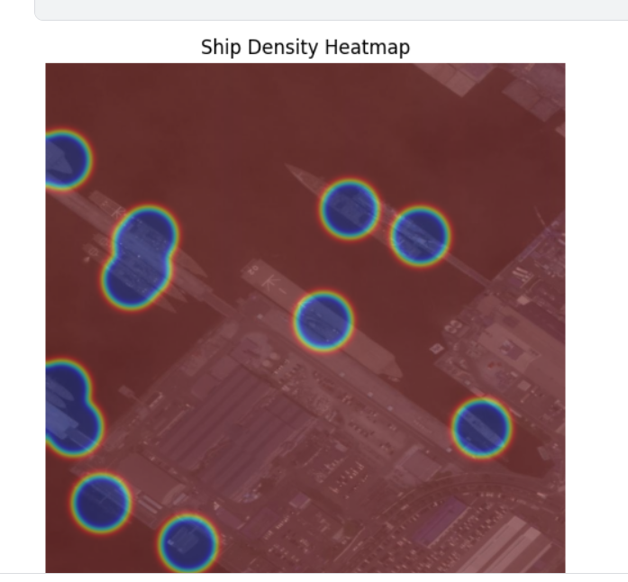
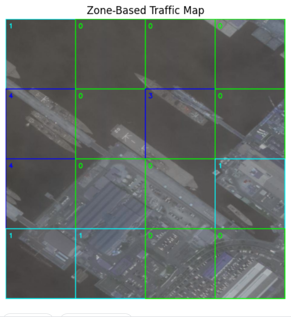

# Satellite-Based Maritime Intelligence System
A computer vision system that analyzes satellite imagery to detect ships, assess traffic density, identify hotspots, and generate actionable maritime intelligence.

A computer vision pipeline that detects, classifies, and analyzes ships in satellite imagery using YOLOv8. It provides congestion assessment, military/civilian classification, risk scoring, clustering alerts, and visual heatmaps.

---

## Pipeline Overview

```
Satellite Image -> YOLOv8 Detection -> Ship Counting -> Congestion Analysis
-> Military/Civilian Classification -> Risk Assessment -> Alert System
-> Density Heatmap -> Zone-Based Hotspot Detection
```

---

## Project Structure

```text
satellite-maritime-intelligence/
│
├── main.py                          # Entry point and pipeline orchestrator
├── requirements.txt                 # Python dependencies
├── models/
│   └── detector.py                  # YOLOv8 model loading and inference
├── analysis/
│   └── maritime_analysis.py         # Ship counting, risk, congestion, alerts
├── visualization/
│   └── visualizer.py                # Heatmaps, zone overlays, detection display
├── configs/
│   └── ship_classes.py              # Military and civilian ship class definitions
├── assets/                          # README demo images and visual outputs
├── test/                            # Test satellite images
├── runs/                            # YOLOv8 training outputs and weights
```

---

## Installation

**Requirements:** Python 3.8+


```bash
pip install -r requirements.txt
```
---


### Dependencies


| Package | Version |
|---|---|
| ultralytics | >= 8.0.0 |
| opencv-python | >= 4.6.0 |
| numpy | >= 1.23.0 |
| matplotlib | >= 3.3.0 |
| scipy | >= 1.4.1 |
| PyYAML | >= 5.3.1 |

---

## Usage

```bash
python main.py --image <path_to_image> --weights <path_to_weights> --grid <grid_size>
```


### Arguments

| Argument | Required | Default | Description |
|---|---|---|---|
| `--image` | Yes | — | Path to satellite image (`.jpg`, `.png`, etc.) |
| `--weights` | No | `runs/detect/train/weights/best.pt` | Path to trained YOLOv8 `.pt` weights |
| `--grid` | No | `4` | Grid size for zone-based hotspot detection |

### Example

```bash
python main.py \
    --image test/images/harbor.jpg \
    --weights runs/detect/train/weights/best.pt \
    --grid 4
```

---

## Output

The pipeline prints a full analysis report to the terminal and opens three visualizations.

### Terminal Output

```
=======================================================
   Satellite Maritime Intelligence System
=======================================================

[Ship Count]
  Total Ships     : 12
  Class Breakdown : {'Cargo': 5, 'Destroyer': 2, 'Tanker': 5}

[Congestion]
  Traffic Level   : Medium
  Traffic Density : Moderate

[Risk Assessment]
  Military Ships  : 2
  Civilian Ships  : 10
  Unknown Ships   : 0
  Risk Level      : Medium

[Clustering Analysis]
  Normal distribution.

[System Alert]
  WARNING: Military presence detected.

[Zone Analysis]
  Zone Ship Counts:
  [[1 0 2 1]
   [0 3 1 0]
   ...]
  Hotspot Zones (row, col): [[1, 1]]
```

### Visualizations

| Output | Description |
|---|---|
| YOLOv8 Detection | Bounding boxes with class labels drawn over the image |
| Ship Density Heatmap | Gaussian heatmap blended over the image showing ship concentration |
| Zone-Based Traffic Map | Grid overlay colored green to red by zone ship count |

---

## Analysis Modules

### Ship Counting
Counts total detected ships and breaks them down by class using YOLOv8 detection results.

### Congestion Level
| Ships | Level |
|---|---|
| < 5 | Low |
| 5 - 14 | Medium |
| >= 15 | High |

### Military / Civilian Classification
Ships are mapped to pre-defined class lists and counted separately. Unrecognized classes are flagged as Unknown.

### Risk Level
| Condition | Risk |
|---|---|
| No military ships | Low |
| Military < 30% of total | Medium |
| Military >= 30% of total | High |

### Unusual Clustering
Computes pairwise distances between ship centers. If any two ships are closer than 50 pixels, a clustering alert is raised.

### Alert System
| Condition | Alert |
|---|---|
| Military + High congestion | CRITICAL ALERT |
| Military present | WARNING: Military presence |
| High congestion only | WARNING: Heavy traffic |
| Otherwise | Normal activity |

---

## Ship Classes

### Military
`Destroyer`, `Cruiser`, `Frigate`, `Submarine`, `Warship`, `Commander`, `Aircraft Carrier`

### Civilian
`Cargo`, `Tanker`, `Fishing`, `Passenger`, `Yacht`, `Barge`, `Container Ship`, `Bulk Carrier`, `Oil Tanker`, `Tug`, `Auxiliary Ships`, `Patrol`, `Landing`, `Hovercraft`, `Sailboat`, `Carrier`, `Boat`, `Other`


## Demo Results

### YOLOv8 Ship Detection


### Ship Density Heatmap



### Zone-Based Traffic Map




## Training Your Own Model

This system uses a standard YOLOv8 model. To train on your own ship dataset:

```bash
yolo detect train data=ship_data.yaml model=yolov8n.pt epochs=100 imgsz=640
```

Point `--weights` to your output `best.pt` when running the pipeline.


## Future Improvements

- Multi-frame ship tracking
- AIS (Automatic Identification System) integration
- Real-time satellite feed processing
- Geospatial coordinate mapping
- DBSCAN-based maritime clustering
- Streamlit/Web dashboard deployment
- Temporal anomaly detection

## License

This project is provided for research and educational purposes.
