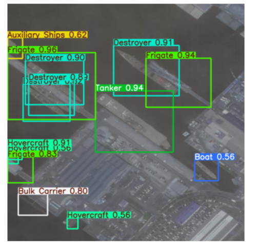

# Satellite-Based Maritime Intelligence System

> Turning satellite pixels into actionable sea intelligence — one ship at a time.

---

## What is this?

I built this project because I wanted to go beyond standard object detection. Most ship detection projects stop at "here's a bounding box." This one goes further — it tells you *how many* ships are in a zone, *what kind* they are, whether the area is congested, which zones are hotspots, and whether there's anything worth flagging from a defense perspective.

The whole pipeline runs on a single satellite image and spits out a full intelligence report with heatmaps, zone analysis, and risk classifications.

---

## Features

### Ship Detection & Classification
Uses **YOLOv8** under the hood. The model can detect and classify **25 different ship types** — cargo ships, tankers, destroyers, fishing vessels, and more. Training was done on Kaggle with GPU support.

### Ship Counting
After detection, the system counts total ships in the frame and gives you a class-wise breakdown. So instead of just "17 ships detected," you get "8 cargo, 4 tankers, 3 destroyers, 2 unknown."

### Congestion Analysis
Based on ship density, the system assigns one of three traffic levels:
- **Low** — clear waters, normal activity
- **Medium** — moderate traffic, worth monitoring
- **High** — heavy congestion, possible port bottleneck or incident

### Risk Assessment
Ships are classified into **Military** or **Civilian** categories. If the system detects unusual concentrations of military vessels or flagged ship types, it generates an alert. Nothing fancy — but useful as a first-pass filter for analysts.

### Density Heatmap
A visual overlay showing where ships are concentrated. Really useful for spotting emerging hotspots that aren't obvious from bounding boxes alone.

### Zone-Based Hotspot Detection
The image is divided into a grid. Each zone is scored based on ship count and class distribution. The system identifies the **busiest zones** and can flag multiple hotspots simultaneously — great for port surveillance.

---

## System Pipeline

```
Satellite Image Input
       ↓
YOLOv8 Detection (bounding boxes + class labels)
       ↓
Ship Counting (total + per-class)
       ↓
Congestion Analysis (Low / Medium / High)
       ↓
Risk Assessment (Military / Civilian + alerts)
       ↓
Density Heatmap Generation
       ↓
Zone-Based Hotspot Detection
       ↓
Final Maritime Intelligence Report
```

---

## Tech Stack

| Tool | Purpose |
|------|---------|
| Python | Core language |
| YOLOv8 (Ultralytics) | Ship detection & classification |
| OpenCV | Image processing |
| NumPy | Numerical operations |
| Matplotlib | Heatmap & visualization |
| Kaggle (GPU) | Model training environment |

---

## Model Performance

Trained on a multi-class ship detection dataset. Results after training:

| Metric | Score |
|--------|-------|
| mAP50 | ~0.67 |
| mAP50-95 | ~0.55 |

Not perfect — especially on small or occluded ships — but solid enough for a first version. I'm actively looking at ways to push mAP50 past 0.75.

---

## Project Structure

```
ship_project/
│
├── train/          # Training images & labels
├── valid/          # Validation set
├── test/           # Test images
├── runs/           # YOLOv8 training runs & weights
├── data.yaml       # Dataset configuration
├── main.py         # Main inference + intelligence pipeline
└── README.md
```

---

## Sample Output

Running `main.py` on a satellite image produces:

- Annotated image with bounding boxes and class labels
- Ship count breakdown by category
- Congestion level classification
- Density heatmap overlay
- Zone-wise hotspot report with coordinates

---

## Use Cases

This isn't just a demo project. There are real applications here:

- **Port monitoring** — Track vessel traffic and flag congestion before it becomes a problem
- **Defense & surveillance** — Identify unusual military vessel concentrations
- **Logistics & shipping** — Optimize routing based on real-time port load
- **Border monitoring** — Flag unauthorized or unclassified vessels in restricted zones

---

## What's Next

A few things I want to add:

- **Ship tracking across frames** — extend this to image sequences or video so you can follow individual vessels over time
- **Real-time pipeline** — connect to a live satellite feed instead of batch processing static images
- **Better military classification** — the current model struggles with ambiguous vessel types; I want to fine-tune on a more targeted dataset
- **Geospatial integration** — overlay detections on actual map coordinates using satellite metadata

---


---

## Run the Project

```bash
pip install -r requirements.txt
python main.py --image path/to/image.jpg


Example Command

```bash
python main.py --image test/images/sample.jpg --weights runs/detect/train/weights/best.pt

Arguments
--image     Path to input satellite image  
--weights   Path to trained YOLOv8 weights  
--grid      Grid size for zone-based analysis (optional, default=4)


```


---

## Demo

### Detection Output


### Density Heatmap


### Zone-Based Traffic Analysis


```markdown
**Detection:** Multi-class ship detection using YOLOv8  
**Heatmap:** Density-based ship concentration visualization  
**Zone Map:** Grid-based hotspot detection  

---

## Author

**Vipanshu Singh**  
B.Tech CSE

---

*If you find this useful or want to collaborate on the tracking/real-time extensions, feel free to reach out.*
